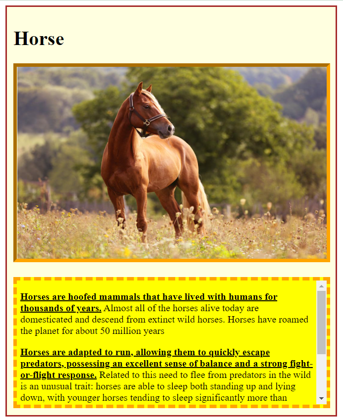

# week01_day03_CSS2_Horse
## Task 
* Add appropriate margin, border, and padding to the text div.
* Add appropriate border to the image.
* Create a div for all of the page content and center that in the middle of the page.
* Add appropriate border and padding to that div.
 
### The ouput

